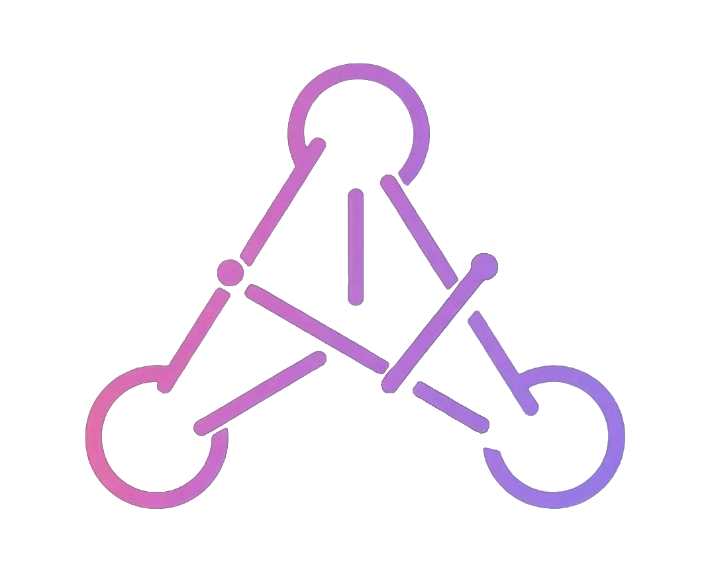

<div align="center">
  
  <h1>ARDEN — AI-Driven Game Narrative Editor</h1>
  <p><strong>McMaster University · COMPSCI 4ZP6 Capstone · Team 30</strong></p>
  <p>
    Cathy Xu &nbsp;·&nbsp; Duzhi Wu &nbsp;·&nbsp; Moein Roghani &nbsp;·&nbsp; Xingjian Zheng
  </p>
  <p>
    <a href="https://arden-dev.com"><strong>🌐 Live Application → arden-dev.com</strong></a>
  </p>
</div>

---

## Quick Start for TAs

The application is **fully deployed and publicly accessible**. No local setup required.

1. Go to **[arden-dev.com](https://arden-dev.com)**
2. Click **Get Started → Create Account**
3. Register with any email and password — save your credentials
4. Log in anytime with those credentials
5. Create a project and start chatting with the AI narrative assistant

> The live environment is the full production system: React frontend, Python/FastAPI AI backend, Node.js data service, and PostgreSQL — all running on DigitalOcean.

---

## Demo Video

[](https://youtu.be/L2KalKY0AOI)

**[▶ Watch the demo on YouTube](https://youtu.be/L2KalKY0AOI)**

---

## Submission Documents

| Document | Link |
|---|---|
| Software Requirements Specification (SRS) | [Group_30_SRS.pdf](./docs/Group_30_SRS.pdf) |
| Design & Verification and Validation | [Group_30_Design_VnV.pdf](./docs/Group_30_Design_VnV.pdf) |
| Final Reflection | [Group_30_Reflection.pdf](./docs/Group_30_Reflection.pdf) |
| Capstone Poster | [ARDEN_Capstone_Poster.pdf](./docs/ARDEN_Capstone_Poster.pdf) |

---

## Project Repositories

| Repository | Description |
|---|---|
| [arden-studio-web](https://github.com/ARDEN-MC/arden-studio-web) | React SPA — multi-panel dashboard, graph editor, AI chat, lore bible |
| [arden-studio-api](https://github.com/ARDEN-MC/arden-studio-api) | Python/FastAPI — multi-agent AI orchestration (LangGraph + OpenAI) |
| [arden-studio-data-service](https://github.com/ARDEN-MC/arden-studio-data-service) | Node.js/Express — PostgreSQL data service |
| [arden-unity](https://github.com/ARDEN-MC/arden-unity) | Unity plugin — runtime narrative engine for AI-generated stories |

---

## What ARDEN Does

ARDEN extends Microsoft's GENEVA research (IEEE CoG 2024) into a full production platform. It is the only tool that unifies **AI-assisted narrative generation** with a **live visual graph editor** in a single interface.

- Users converse naturally with an AI assistant that directly reads, creates, and modifies narrative graphs and world-building data
- Every AI change is instantly reflected in the visual editor
- Narratives export as structured JSON, playable in Unity via the included `NarrativeTool` plugin
- Full authentication, project management, and session persistence

### Architecture at a Glance

```
React SPA (arden-dev.com)
    ↕
Python/FastAPI API  ←→  LangGraph Multi-Agent System
    ↕                        ├── Supervisor (GPT, MemorySaver)
Node.js Data Service         ├── Lore Bible Expert (stateless)
    ↕                        └── Narrative Graph Expert (stateless)
PostgreSQL
```

All four services are containerized with Docker Compose and deployed on DigitalOcean.

---

## Running Locally (Optional)

If you prefer to run locally instead of using the live site:

**Prerequisites:** Docker and Docker Compose installed.

```bash
git clone https://github.com/ARDEN-MC/arden-studio-web
git clone https://github.com/ARDEN-MC/arden-studio-api
git clone https://github.com/ARDEN-MC/arden-studio-data-service
```

Each repo contains a `.env.example` — copy to `.env` and fill in your OpenAI API key and a database password. Then from the root directory containing all three repos:

```bash
docker compose up --build
```

The web app will be available at `http://localhost:8080`.

> **Note:** An OpenAI API key is required for the AI features. The live site at [arden-dev.com](https://arden-dev.com) already has this configured — we recommend using it directly.

---

## Unity Plugin

The Unity plugin (`NarrativeTool`) is available in the [arden-unity](https://github.com/ARDEN-MC/arden-unity) repository as a `.unitypackage`.

1. Export a narrative project as JSON from ARDEN Studio
2. Import `Arden Unity Plugin.unitypackage` into your Unity project
3. The plugin provides a DAG traversal state machine, variable store, condition evaluator, and editor tools (Graph Visualizer, JSON Simulator) ready to drive the exported narrative

---

<div align="center">
  <sub>© 2026 ARDEN-MC · McMaster University Computer Science Undergraduate Capstone · Supervisor: Dr. Mehdi Moradi</sub>
</div>
